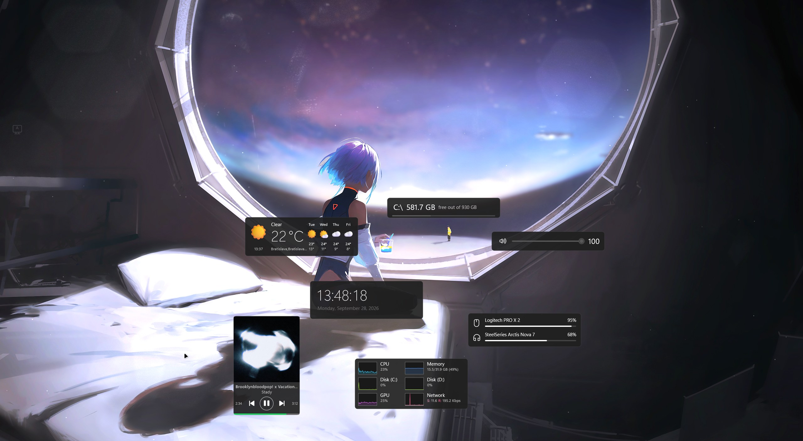

# Win11 Widgets

**A Windows 11 remake of the classic Win10 Widgets for [Rainmeter](https://www.rainmeter.net).**

Win11 Widgets brings the clean, minimal desktop widgets of Win10 Widgets into the Windows 11
era, with rounded cards, the Segoe UI Variable font, Fluent icons and your Windows accent
color. It also fixes the parts that stopped working over the years, like the weather, and
adds GPU monitoring and automatic detection of extra drives.

> Remake by **ketamine**. Based on [Win10 Widgets](http://win10widgets.com) by **TJ Markham**,
> the original author. All credit for the original design goes to him.

---

## Features

- **Windows 11 design:** rounded cards, subtle borders, the Segoe UI Variable font and
  Segoe Fluent Icons, all following your Windows accent color
- **Weather:** live weather from Open-Meteo (no API key needed), automatic location, and
  search by city or postal code. It shows current conditions and a 5-day forecast with
  colorful Fluent weather icons.
- **Performance:** CPU, **GPU**, memory, disk and network graphs. Extra drives (D:, E:,
  USB, ...) appear automatically when connected and disappear when removed.
- **Volume:** a Windows 11 style slider with the Fluent volume icon
- **Hard drive:** free space with a rounded usage bar
- **Date & time**, **Battery**, **WiFi**, **Spotify**, **Lock** and **Layout switcher**

## Installation

1. Install [Rainmeter](https://www.rainmeter.net) 4.5 or newer.
2. Download `Win11 Widgets 1.1.0.rmskin` from [Releases](../../releases) and double-click it.
3. Click **Install**, then right-click the Rainmeter tray icon → **Skins** → **Win11 Widgets**
   and load the widgets you want.

**Tip:** right-click any widget → **Variants** to switch its size.
Right-click the weather widget to set your location or switch between °C and °F.

## Requirements

- Windows 10 or 11 (Windows 11 recommended; the Segoe UI Variable and Segoe Fluent Icons
  fonts come with it)
- Rainmeter 4.5+

## What's new compared to Win10 Widgets

- Fixed the weather widget, which had shown "Connection Error" since Yahoo's weather
  service shut down
- Location search that works worldwide, with postal codes
- The forecast starts from tomorrow instead of repeating today
- GPU usage and automatic extra-disk detection in Performance Combo
- A complete Windows 11 visual refresh

See [CHANGELOG.md](CHANGELOG.md) for the full list.

## Credits & License

- **Original:** [Win10 Widgets](http://win10widgets.com) by TJ Markham

